# ☁️ CloudSeekers

### Previsão Inteligente de Incidentes e Gestão Proativa de OLA

Projeto desenvolvido para o **Enterprise Challenge FIAP + Locaweb 2026**.

O **CloudSeekers** é uma solução de AIOps que transforma dados históricos de incidentes em inteligência preditiva para apoiar equipes de operações de TI.

A solução prevê o volume de incidentes **P2 e P3 nos horizontes D+1 e D+7**, calcula o **risco de violação de OLA por incidente** e disponibiliza os resultados em uma aplicação web desenvolvida em **Streamlit**.

---

## 🎯 Objetivo

Apoiar equipes de **NOC, SRE e operações de infraestrutura** na antecipação de cenários críticos.

O CloudSeekers busca:

- prever o volume de incidentes P2 e P3;
- antecipar comportamento para D+1 e D+7;
- calcular um score de risco de violação de OLA;
- classificar incidentes por nível de risco;
- facilitar a priorização operacional;
- transformar dados históricos em apoio à tomada de decisão.

---

## 🚨 Problema

Em operações de TI de grande escala, o volume de incidentes pode variar significativamente ao longo do tempo.

Picos inesperados podem aumentar a carga das equipes operacionais e elevar o risco de descumprimento dos acordos de nível operacional.

Em uma operação predominantemente reativa, esse cenário costuma ser percebido somente quando o impacto já está acontecendo.

O CloudSeekers propõe uma abordagem preditiva:

> **antecipar → identificar risco → priorizar → agir**

---

## 💡 Solução

A solução é baseada em três pilares principais:

### 1. Forecast de Incidentes

Previsão do volume de incidentes P2 e P3 para os próximos dias.

Horizontes utilizados:

- D+1
- D+2
- D+3
- D+4
- D+5
- D+6
- D+7

### 2. Risco de OLA

Cada incidente recebe um **score probabilístico de risco**, permitindo identificar quais chamados possuem maior probabilidade de violação do OLA.

Os resultados são classificados em níveis operacionais de risco.

### 3. Priorização Operacional

A aplicação permite visualizar os incidentes de maior risco e aplicar filtros por características como prioridade e categoria, apoiando a tomada de decisão da operação.

---

## 🏗️ Arquitetura da Solução

O CloudSeekers utiliza uma arquitetura em camadas, transformando dados históricos de incidentes em previsões e indicadores de risco consumidos pela aplicação operacional.

```mermaid
flowchart LR

    A["📁 Dados Brutos<br/>Incidentes / ITSM"] --> B["🥉 BRONZE<br/>Dados históricos"]

    B --> C["⚙️ ETL<br/>Python + Pandas"]

    C --> D["🥈 SILVER<br/>Dados tratados<br/>Feature Engineering"]

    D --> E["🤖 MACHINE LEARNING"]

    E --> F["📈 Forecast<br/>P2 / P3<br/>D+1 até D+7"]
    E --> G["⚠️ Risco de OLA<br/>Score por incidente"]

    F --> H["🥇 GOLD"]
    G --> H

    H --> I["☁️ Azure SQL Database"]

    I --> J["🖥️ Streamlit<br/>Aplicação Web"]

    J --> K["🎯 Decisão Operacional<br/>Antecipar • Priorizar • Agir"]

    classDef raw fill:#24243a,stroke:#7b61ff,color:#ffffff,stroke-width:2px;
    classDef bronze fill:#6b4423,stroke:#d39b65,color:#ffffff,stroke-width:2px;
    classDef silver fill:#4b5563,stroke:#cbd5e1,color:#ffffff,stroke-width:2px;
    classDef ml fill:#5527c9,stroke:#9d7cff,color:#ffffff,stroke-width:2px;
    classDef gold fill:#9a7200,stroke:#ffd84d,color:#ffffff,stroke-width:2px;
    classDef cloud fill:#0369a1,stroke:#38bdf8,color:#ffffff,stroke-width:2px;
    classDef app fill:#087f8c,stroke:#23d5d5,color:#ffffff,stroke-width:2px;
    classDef action fill:#176b45,stroke:#45d18a,color:#ffffff,stroke-width:2px;

    class A raw;
    class B bronze;
    class C,D silver;
    class E,F,G ml;
    class H gold;
    class I cloud;
    class J app;
    class K action;
```

### Fluxo resumido

**Dados → Tratamento → Machine Learning → Gold → Azure SQL → Streamlit → Decisão**

O pipeline possui dois produtos principais de Machine Learning:

- **Forecast de Incidentes:** previsão de volume P2/P3 para D+1 até D+7.
- **Risco de OLA:** score probabilístico para priorização dos incidentes com maior risco de violação.

Os resultados são persistidos na camada **Gold do Azure SQL Database** e consumidos pela aplicação **CloudSeekers em Streamlit**.
